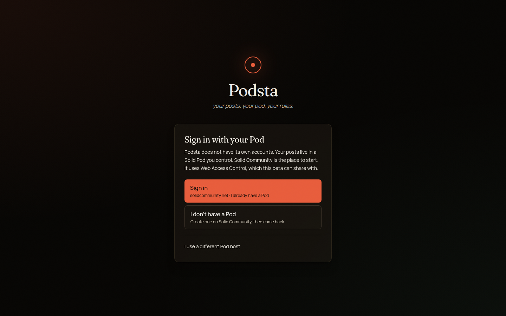
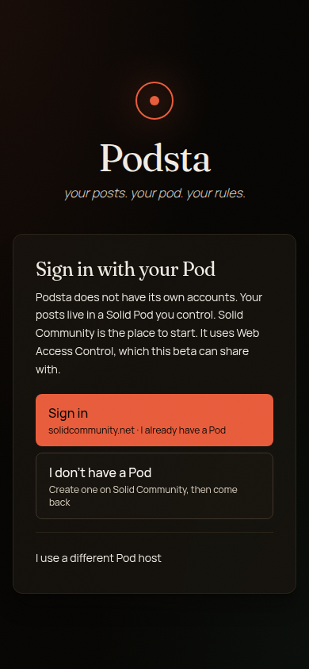
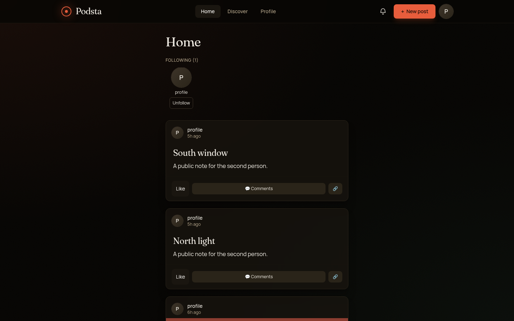
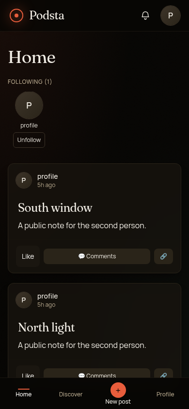
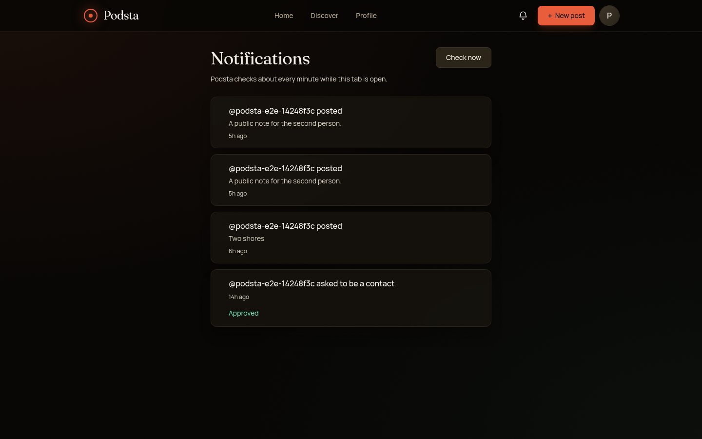
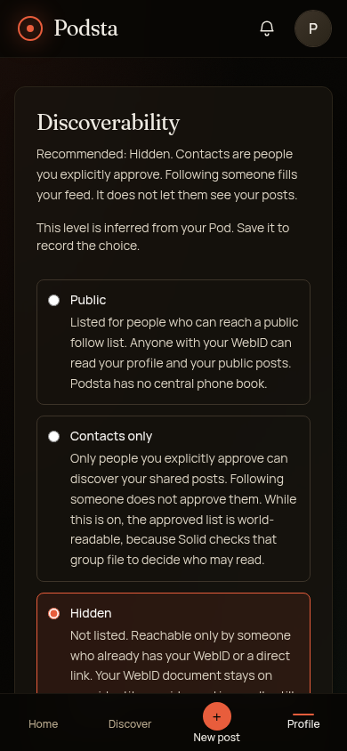
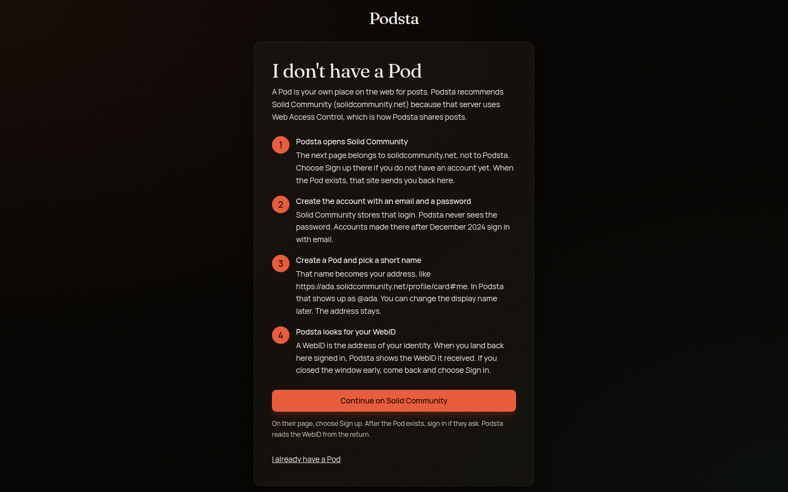
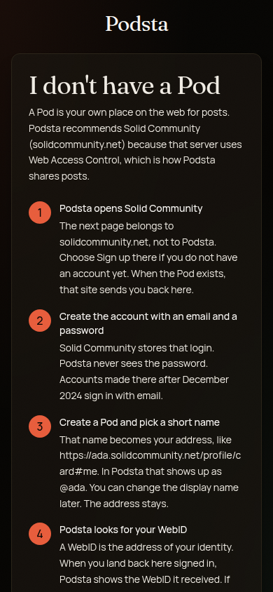

# Podsta

> Your posts. Your Pod. Your rules.

Podsta is a photo-and-text app that stores everything in your [Solid Pod](https://solidproject.org). There is no Podsta server and no central directory. The signed-in browser talks to your Pod, and to the Pods of people you follow, with Web Access Control.

The public app is [https://teebooted.github.io/Podsta/](https://teebooted.github.io/Podsta/).

A new profile is Hidden. You choose Contacts or Public later. A post cannot be more open than the profile.

## Features

- Home is the following feed. Your own posts live on Profile as a grid.
- Text posts, and photo posts of up to ten pictures, with a carousel in the feed and in the viewer.
- Crop and rotate before upload, drag-and-drop on a desktop, and a progress bar that stays short of 100% until the Pod responds. A failed upload can be retried without sending photos that already landed.
- Per-post audience: Only me, Contacts, or Public, capped by the profile.
- Comments live in the commenter's Pod. The author publishes the list with the same audience as the post, and can hide one or block that person. Other people cannot write the author's Pod.
- Likes stored in the liker's Pod. The author publishes the count and the names for posts they are willing to show.
- In-app notifications for new posts from people you follow, comments on your posts, and contact requests or approvals. The app polls. It does not run a notification server.
- Discover by WebID, with copy-my-WebID, invite links, and a QR code. A short name like `@ada` is derived from the WebID. It is not a registered handle.
- A sign-up guide for people without a Pod. Solid Community is the recommended host. An existing Web Access Control Pod can sign in directly.
- Phone layout with Home, Discover, New post, and Profile. Desktop uses the header. Keyboard: `h` home, `d` discover, `p` profile, `n` new post. Shortcuts are ignored while you are typing or a dialog is open.

Podsta is not an installable app. `public/manifest.json` is a stub. There is no service worker.

## Screenshots

Signed-out start, and a signed-in feed, from the current build.













The guide for someone without a Pod is at `/start`.





## Quick start

You need a Solid Pod on a server that uses Web Access Control.

**No Pod yet.** Open Podsta and choose **I don't have a Pod**. The guide sends you to [Solid Community](https://solidcommunity.net). Create the account there with an email and a password. Accounts created after December 2024 sign in with that email. Podsta never sees the password. When the Pod exists, that site sends you back here. Your WebID looks like `https://ada.solidcommunity.net/profile/card#me`, which Podsta shows as `@ada`.

**You already have a Pod.** Choose **Sign in**. Solid Community is the recommended host. [solidweb.org](https://solidweb.org) also uses Web Access Control. Inrupt PodSpaces is listed so you can see why it is not supported: it uses access policies this app cannot write.

After sign-in you can skip the short tour. The profile starts Hidden. Copy your WebID from Home or Discover and send it to someone, or follow a WebID you already know. Invite links use `/invite?webid=`.

## For developers

Node.js 22. That is the version CI uses.

```bash
npm ci
npm run dev       # http://localhost:5173
npm test          # node --test tests/*.test.js
npm run lint      # eslint src
npm run build     # static files in dist/
npm run preview   # serve the production build
```

`npm run dev` opens a browser tab. Solid sign-in on localhost has to stay on `localhost`, not `127.0.0.1`, because the OIDC client is registered for that origin.

`dist/` is a static site. `vercel.json` rewrites every route to `index.html` and sets a Content-Security-Policy, `X-Frame-Options: DENY`, and a referrer policy. Production needs HTTPS. Localhost is the exception Solid allows for development.

GitHub Pages builds with `PAGES_BASE=/Podsta/`. That workflow copies `index.html` to `404.html`, so `/invite` and `/post` still open. The Solid client id for that origin is `public/solid-client-id.json`. Localhost and CI stay at `/`, and localhost keeps dynamic registration.

See [docs/ARCHITECTURE.md](docs/ARCHITECTURE.md) for the Pod layout, access rules, and notification polling. See [CONTRIBUTING.md](CONTRIBUTING.md) before opening a change, and [CHANGELOG.md](CHANGELOG.md) for the 9–10 October work. [docs/IMPROVEMENT_PLAN.md](docs/IMPROVEMENT_PLAN.md) records what shipped and what is still open.

## License

[MIT](LICENSE). Copyright 2026 Matthew Nielsen.
